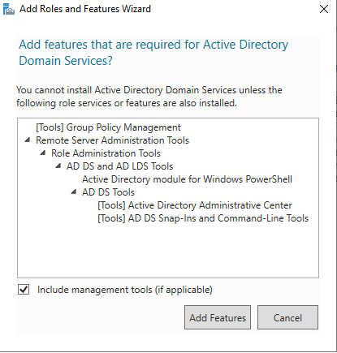
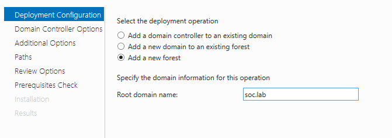

Active Directory.

-Download
-Go to Microsoft Evalcenter.

-Select "Download the ISO file" - 64 bit in English.

-Create a new virtual machine and name it SOC_AD or something similar.

-As a vmdk, Go to the VM properties:
-In the Network tab, change the configuration to use internal network: GREEN

Launch the VM: It will ask you which ISO Virtualbox must mount on the VM, load the Windows Server one.

Installation of Windows:
Select English only!

Select "install now."

Select "Windows Server 2022 Datacenter Evaluation (Desktop Experience)".

Accept software licence.

Select Custom install.

Configuration of Windows:
Connect to your administrator account.

Go to "Open Network & Internet Settings."

Change adapter options.
Select your card properties.
Go to "Internet Protocol Version 4" > Properties.
Assign IP.
Try to join the gateway. (see your LAN INTERFACE in pfsense)
Rename the server with an easy name to remember/use like SOC_AD1
Restart VM.

Installation of Active Directory:
Connect to your administrator account.

Select "Add roles and features."

Add a role-based installation.
Select the only server you've got.
Add "Active Directory Domain Services."

Leave the other Windows settings with defaults configurations.
After it is complete, promote this server to a domain controller.

Add a new Active Directory Forest.

Leave default configurations and give a password.

Leave DNS part by default.
Check the NetBIOS domain name.
Leave the default path.
Launch the install.
Reboot when asked for it.

Configuration of Active Directory:
Now you have the Active Directory Server, you need to populate it with misconfiguration to perform analysis. We will use BadBlood for this task, Please follow the instructions below:

-Download it on the AD
-Extract it
-Launch Powershell as administrator
-Go to Badblood folder
-Launch Invoke-BadBlood.ps1
-Let the magic happen (this can take several minutes)

Now, you have the Active Directory configuration (2500 users, 500 groups, OU, 100 computers, etc.), have fun!

PART 2 DONE
