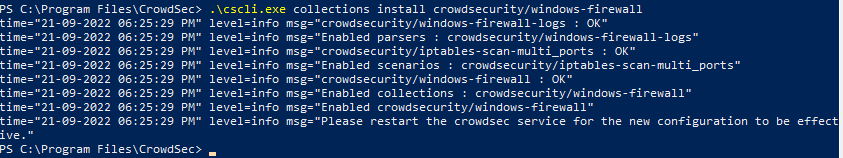
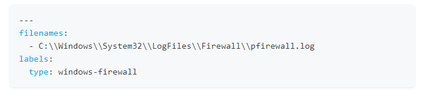
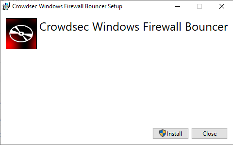
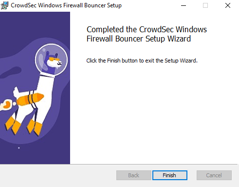

CrowdSec

Account
-Go to the crowdsec site.
-Select "create free account".
-Create the free account and log in to CrowdSec.

Install for Linux
When you're logged in you will have all the information to install the Linux.

Install for Windows
-Go to the GitHub page.
-Download the .msi file on the Windows computer. (server and workstation)
-Launch it.

Contrary to Linux, CrowdSec does not support the automatic configuration at installation time. If you want to be able to detect something other than RDP or SMB brute force, then you will need to customize your acquisition configuration.

- Launch Powershell as an administrator in CrowdSec's folder.

- Command: .\cscli collections install crowdsecurity/windows-firewall

-Open the acquis.yaml file in "C:\ProgramData\CrowdSec\config".
-Add this to it.

-Reboot the computer.

Advanced Install for Windows:
If you want your Crowdsec with block abilities, then you need to install the Windows Firewall Bouncer Installation.

-Go to the dedicated page. <a href="https://github.com/crowdsecurity/cs-windows-firewall-bouncer/releases">
-Download the bundle file. (contain all dependancies)
-Launch it.

 you should see this

 how it all ends.

A WHOLE LAB DONE
