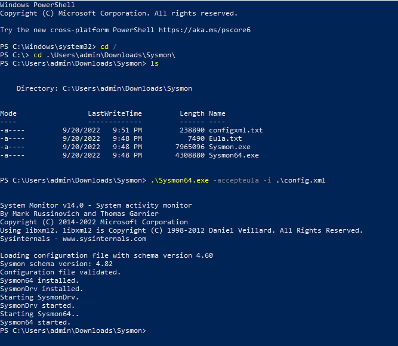

Sysmon:

Download Sysmon
-Go to Windows Sysinternals page.
-Download Sysmon. <a href="https://download.sysinternals.com/files/Sysmon.zip">
-Extract it.

Download the Configuration File
-Download the xml file.
-Save it in the Sysmon's folder.

Install It
-Launch Powershell in administrator.
-Install it with "sysmon.exe -accepteula -i YOURFILE.xml".

