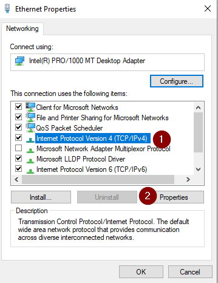
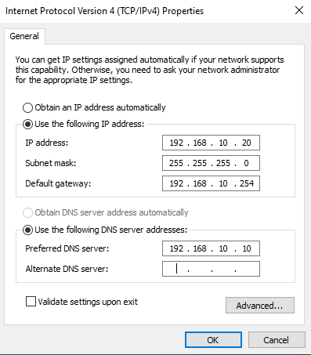
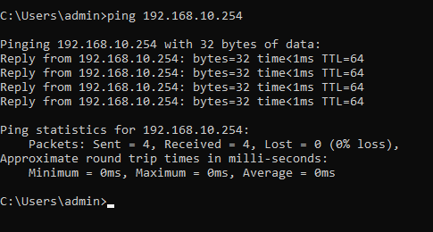
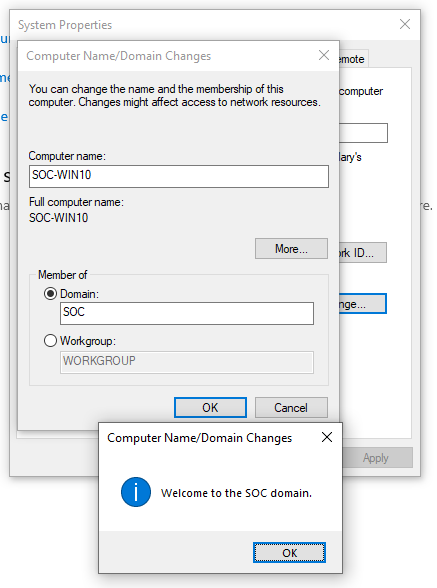

Windows Workstation:

Download
-Download the tool offered by Microsoft. <a href="https://go.microsoft.com/fwlink/?LinkId=691209">
-Launch it.
-Accept the software license.
-Select "create an installation support" to make an ISO.
-Select the English language.

-Select "ISO file."
-Save the file on your computer.

VirtualBox Settings:
Create a new virtual machine.
Name it SOC_Win10

Go to the VM properties, as before in the AD tut-
In the Network tab, change the configuration to use the internal network: GREEN

Launch it.

Now install Windows
-Select "I don't have a product key". (or enter the one you have)
-Select Windows 10 Pro version.
-Wait until its done
-Select " Continue with limited setup"

Configuration of Windows:
-Connect to your administrator account.
-Go to "Open Network & Internet Settings".
-Change the adapter options.
-Select your card properties.
-Go to "Internet Protocol Version 4" > Properties.

Assign IP

Try to join the gateway. (so your LAN INTERFACE in pfSense)

Rename the server with another name you can remember easily like SOC_WIN10

Restart VM!

Now, Add Your Workstation to the Domain
-Go to "Advanced system settings".
-Select "Change".
-Select "Domain" and give your netbios domain name.
-Give your Administrator domain account credentials.

Thats it.

PART 3 DONE
