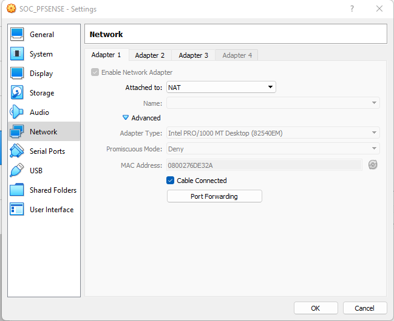
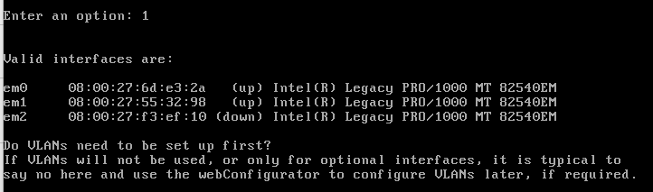
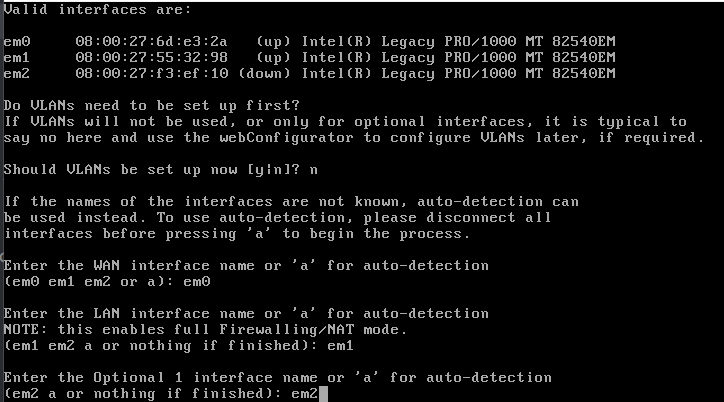

Download
Go to the official site.

Download the last stable version of the community edition.

VirtualBox Settings
Create a new virtual machine.

Go to the VM properties.

In Network tab, activate 3 adapters.

Making note of the MAC Addresses of each adapters will be useful for future actions. This will be the RED CARD. (external network)

This will be the GREEN CARD. (internal network)

This will be the orange CARD. (dmz)

Launch the VM. It will ask you which ISO Virtualbox must mount on the VM, load the pfsense one.

Installation:

select "install"

next,
-Select your keymap
-Use the default partition (we're in a lab, we just need a firewall)
-Proceed with installation (no miror, no encrypt, nothing)
-Wait until the installation is complete

->>Do not load manual configuration.<<-

->>Do not load manual configuration.<<-
Then reboot the VM.

Configuration:
Now, the server is powered on with the new system.

Select 1 to configure interfaces.

We can see the MAC Addresses. Remember, we recommended to make a note of the MAC addresses. It is always helpful to have/know them.

-Select the RED INTERFACE for WAN
-Select the GREEN INTERFACE for LAN
-Select the last one (ORANGE) for DMZ

Confirm!

-Select 2 to configure the IP address
-Leave the WAN interface as DHCP
-Select 2 to change the LAN interface
-Assign the IP and subnet you want, the gateway must be "none" !

AND THATS PART 1 DONE.
